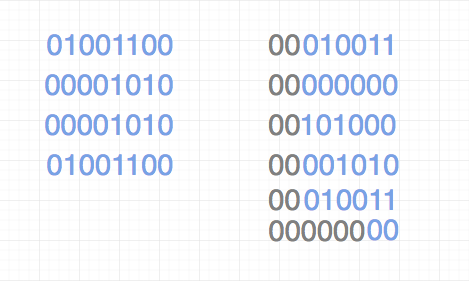

## 每日一题 - base64 编码 会让源代码增加多少？？？

### 信息卡片

- 时间：2019-08-16
- tag：`Base64`
- 题目连接：https://github.com/azl397985856/fe-interview/issues/3

### 题目描述
假如一个二进制文件大小是2M，经过base64编码之后，大小大概会增加多少？

### 解题思路

#### 什么是 Base64

Base64 是一种编码算法，允许你传输任何字符，而不只是 ascii 码。你可以用 Base64 传输任何数据，包括图片，
表情，视频等。从技术上讲，可以说它将 8 位字节转换为 6 位字节。

Base64 不是加密算法，在任何情况下都不应该用于“哈希”密码或“加密”敏感数据，因为它是一种可逆算法，编码数据可以很容易地解码。Base64 可能仅用于编码加密函数的原始结果。粗略地说，就信息安全而言，Base64 只是一种人们不理解的外语。然而，即使他们只需使用在线翻译即可立即返回原始信息，即可理解编码信息的含义。

#### 为什么叫 Base64

最初，该算法被命名为“可打印编码”，并且仅在几年后，在 1992 年 6 月，RFC 1341 将其定义为“Base64”。由于该算法使用 64 个基本字符，因此给它起一个名字并不困难（特别是 Base85 已经存在）。因此，我认为猜测 Base16，Base32，Base36，Base58，Base91 或 Base122 等算法的名称意味着什么并不是问题。

Base64 Alphabet 包含 64 个基本 ASCII 字符，用于编码数据。64 个字符足以编码任何长度的任何数据。唯一的缺点是结果的大小将增加到 33％。

Base64 字母表的字符可以分为四组：

- 大写字母（索引 0-25）： ABCDEFGHIJKLMNOPQRSTUVWXYZ
- 小写字母（索引 26-51）： abcdefghijklmnopqrstuvwxyz
- 数字（指数 52-61）： 0123456789
- 特殊符号（索引 62-63）： +/


除了这些字符之外，等号（=）用于填充。也就是说，等号不具有索引，并且不参与数据的编码。总的来说，填充字符确保 Base64 值的长度是 4 个字节的倍数，并且它总是附加在输出的末尾。然而，算法的核心只包含 64 个字符，并且每个字符都有一个唯一的索引。只有索引确定将使用哪些字符对数据进行编码，并且只有这样才能“恢复”原始数据。所有索引都列在上面的 Base64 表中。

鉴于上述所有情况，可以使用以下正则表达式定义 Base64 值：

```
^[A-Za-z0-9+/]+={0,2}$
```

但是，某些标准允许甚至要求使用多行值。在这种情况下，我们需要通过允许“换行”和“回车”来补充字符列表。

```
^[A-Za-z0-9+/\r\n]+={0,2}$
```

#### Base64 是如何进行编码的？

比如 A 想要传输一个"ABC" 字符串。

首先，您需要逐字母拆分字符串。因此，你有 3 组：

```
A
B
C
```

接下来，您需要将每个组转换为二进制。为此，您需要在每个字母中找到 ASCII 表中相应的二进制值。因此，您有 3 组，每组 8 个字符：

```
01000001
01000010
01000011
```

现在将所有二进制值连接在一起（即，将所有组粘合在一起并确保总共获得 24 个字符）：

```
010000010100001001000011
```

然后，将结果字符串分成组，以便每个字符串有 6 个字符（即，现在您有 4 个组）：

```
010000
010100
001001
000011
```

在此步骤中，您必须将六位字节转换为八位字节。为此，在每个组前面添加前缀“00”（两个零）：

```
00010000
00010100
00001001
00000011
```

在那里你必须通过在 ASCII 表中找到相应的十进制值将每个组从二进制转换为十进制。如果你做的一切正确，每个组将被转换为整数，如下所示：

```
16
20
9
3
```

在前一步骤中获得的整数被称为“Base64 指数”。它们很容易记住，因为它是一个从零开始的编号，其中每个索引对应一个拉丁字母。它以字母“A”开头，按字母顺序排列（即 A = 0，B = 1，C = 2，D = 3，依此类推）。有关完整列表，请参阅 Base64 字符表。因此，匹配索引，将它们转换为相应的字母：

```
Q
U
J
D
```

最后的和弦，连接所有字母以获得 Base64 字符串：`QUJD` 。 也就是说“ABC”的 Base64 结果为“QUJD”。

#### Base64 之后，你的代码会增加多少

在编码期间，Base64 算法用四个字节替换每三个字节，如果需要，添加填充字符，因此结果将始终是四的倍数。简而言之，结果的大小总是比原始数据大 33％（更准确地说，4 / 3）。计算没有填充的结果字符串长度的公式如下：n \* 4 / 3 其中 n 是原始数据的长度。


如图， 灰色表示增加的bit。



#### 题外话

Base64是一种 `binary-to-text`的编码算法。 除了Base64之外，
还有Ascii85， Base16，Base32，Base36，Base58等等。

### 参考

- [base64.guru](https://base64.guru/)
- [Binary-to-text_encoding](https://en.wikipedia.org/wiki/Binary-to-text_encoding)

