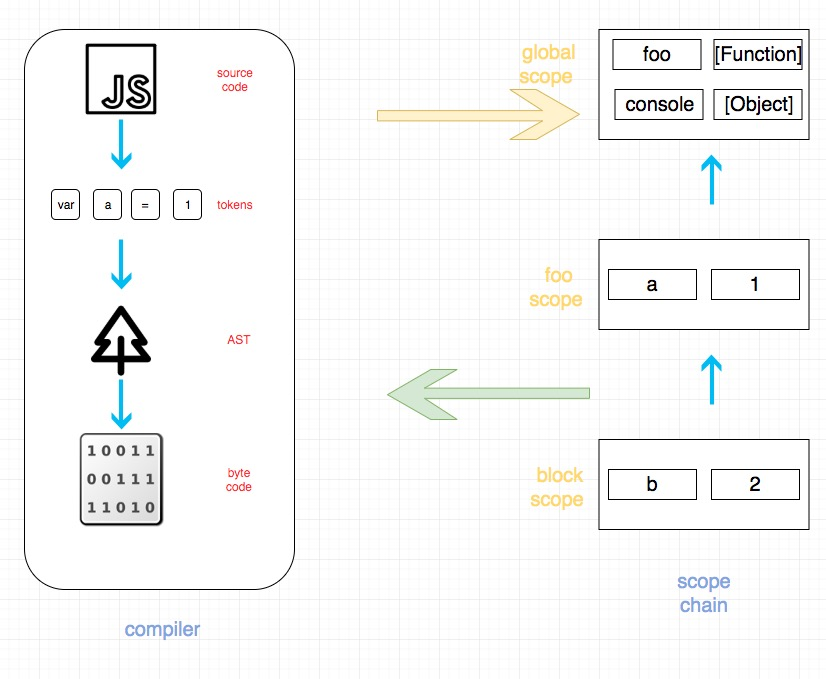
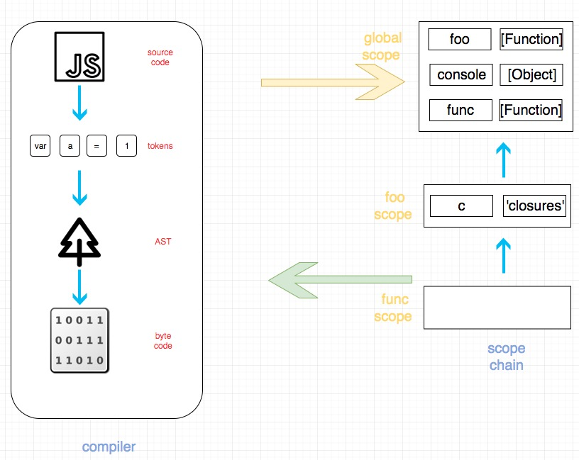

# 作用域与闭包

作用域和闭包一直是 JS 中比较高级的内容，这篇文章打算以图的形式，让大家真正理解作用域和闭包的内容。


## 作用域

作用域(即scope, 其实更确切地说是lexical scope)就是一套变量访问规则，这些规则包括变量如何存储和访问，也就是规定了哪些变量可以被访问，哪些变量不可以被访问。

假设有如下代码：

```js
function foo(a) {
  if (typeof a === "number" || a instanceof Number) {
    const b = a + 1;
    console.log(b);
  }
}
foo();
```

我们来看下这段代码。 这段代码在 JS 引擎执行的时候究竟发生了什么？ 这里我画了个图：



如上图，左边部分是编译器。 右半部分是作用域链。上述代码执行的具体过程大概是：

- JS 源代码经过语法分析，转化成 tokens
- tokens 经过语义分析，转化为 AST(抽象语法树)
- 抽象语法树会被转化为字节码
- JS 运行时开始运行这段上面生成代码
- 当代码执行到函数声明的时候，引擎会向 scope chain 询问(一个 RHS)foo 是否已经声明
  在这里是没有声明，会在当前 scope(也就是 global scope)创建一个 foo
  > console 是 内置对象， 虽然不是我们声明的，但是它已经在全局作用域了。
- 执行 foo。 引擎同样会询问 scope chain(一个 RHS)，foo 是否已经声明。
  在这里是声明了，如果没声明会报`Reference Error`。
- 代码进到了 foo， 我们创建一个新的作用域，这个作用域指向全局作用域，从而形成作用域链。

- 下次引擎发送 RHS，如果当前作用域找到就返回，找不到就沿着链找，最终都找不到就报`Reference Error`，
  过程类似原型链。

- 剩下的我就不解释了，应该能看懂

> 注意图中块级作用域的位置，这也就解释了，为什么块级作用域声明的变量在块外面是无法访问的。

> 上述过程忽略了一些细节，比如生成 optimized AST 和 optimized byte code 的过程

事实上，作用域背后地原理是`词法环境`， 词法环境由两部分组成：

1. 环境记录， 这其实就是JavaScript用来存变量地地方，一个key-value对在这里被成为一个binding。

2. 外部环境的引用

其实它就是一个递归的数据结构，是不是有像刚才我们画地作用域？

我们需要特殊注意的是全局作用域，这是一个特殊的作用域，总是出现在作用域的最外层。全局作用域
对应的环境就是`全局环境`，全局作用域的`外部环境引用`是null。是不是感觉和原型链什么的都很像？


## 闭包

闭包就是当一个函数即使是在它的词法作用域之外被调用时，也可以记住并访问它的词法作用域。

从理论上来说`JS 中一切函数都有闭包`，其原因就是 JS 和大多数编程语言一样采用的是静态作用域.

 但是我们通常谈论的是`可观察的`闭包，什么是可观察？ 我们来举个例子，这是一个`可观察`的闭包例子：

```js
function foo(a) {
  const c = "closures";
  if (typeof a === "number" || a instanceof Number) {
    const b = a + 1;
    console.log(b);
  }
  return () => c;
}
const func = foo();
func(); // 'closures'
```

上面的代码foo作用域的c在foo的外侧被访问到了，这就是一个`可观察`的闭包.

为什么呢？ 这和上面的说的好像不太一样？ 不，是一样的。我同样画了一个图：



说的直白一点就是foo返回的函数`记住了ta被定义的时候的作用域`，因此你可以访问到foo里面定义的变量。
看起来好像是`突破了作用域的限制`，我们称之为`可观察`的闭包。

> 当然没有被这个返回的函数引用的变量还是会被GC销毁

## 参考

- [global-scope](https://2ality.com/2019/07/global-scope.html)